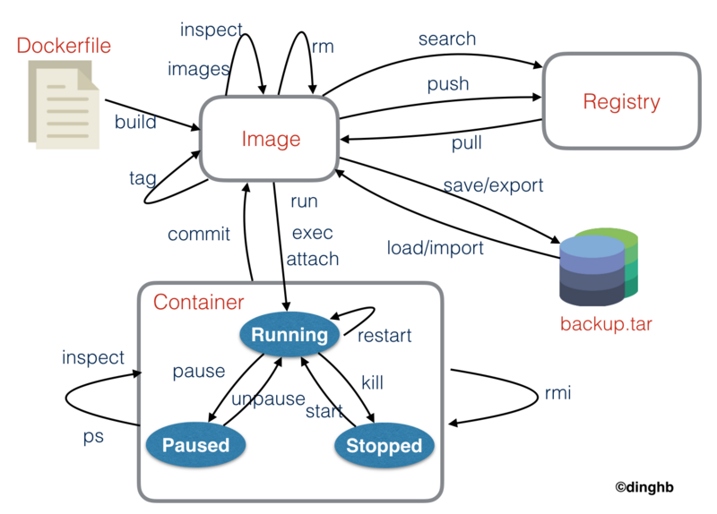

## docker
> Docker 可以让开发者打包他们的应用以及依赖包到一个轻量级、可移植的容器中，然后发布到任何流行的 Linux 机器上，也可以实现虚拟化。容器是完全使用沙箱机制，相互之间不会有任何接口（类似 iPhone 的 app）,更重要的是容器性能开销极低。

### 应用场景
1. Web 应用的自动化打包和发布。
2. 自动化测试和持续集成、发布。
3. 在服务型环境中部署和调整数据库或其他的后台应用。
4. 从头编译或者扩展现有的 OpenShift 或 Cloud Foundry 平台来搭建自己的 PaaS 环境。

### 优点
1. 快速，一致地交付您的应用程序 `Docker` 允许开发人员使用您提供的应用程序或服务的本地容器在标准化环境中工作，从而简化了开发的生命周期。

2. 响应式部署和扩展 `Docker` 是基于容器的平台，允许高度可移植的工作负载。`Docker` 容器可以在开发人员的本机上，数据中心的物理或虚拟机上，云服务上或混合环境中运行。`Docker` 的可移植性和轻量级的特性，还可以使您轻松地完成动态管理的工作负担，并根据业务需求指示，实时扩展或拆除应用程序和服务。

3. 在同一硬件上运行更多工作负载 `Docker` 轻巧快速。它为基于虚拟机管理程序的虚拟机提供了可行、经济、高效的替代方案，因此您可以利用更多的计算能力来实现业务目标。`Docker` 非常适合于高密度环境以及中小型部署，而您可以用更少的资源做更多的事情。

### 核心概念
1. 镜像(image)：docker 镜像就好比类 `class`，可以通过它创建多个容器。
2. 容器(container)：docker 利用容器技术，独立运行一个（可以只运行一个 mysql 服务）或一组（一个整套程序应用）服务，容器通过镜像创建。
3. 仓库(repository)：仓库就是存放镜像的地方，类似于 git 的概念。

