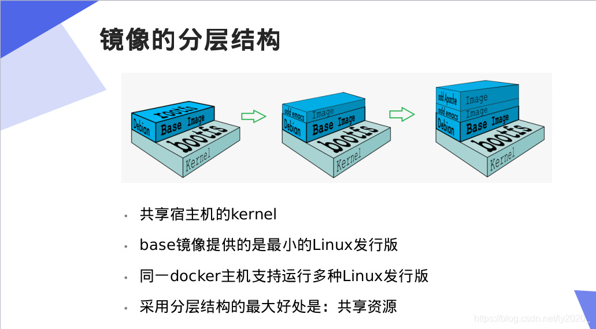

### 分层理解
#### docker 镜像的组成

1. `docker` 的镜像分层系统，在基础镜像上的每一次操作，以增加一层的形式，形成了一个新的镜像;
2. 而不同层的情况下，不同文件分为不同小层;
3. 当 pull 镜像时，docker会检查文件系统，如果它的层中，有已经下载过的，则共享文件，不需要在下载了。
4. docker的镜像是只读的，可以理解为它只是一个类，可以用它生成无数实例。而启动一个镜像时，生成的那个容器，其实就是再原来的镜像层中，再加一层，我们所有的操作，都是基于这个增加的层中，如果此时打包，则生成了一个新的镜像。