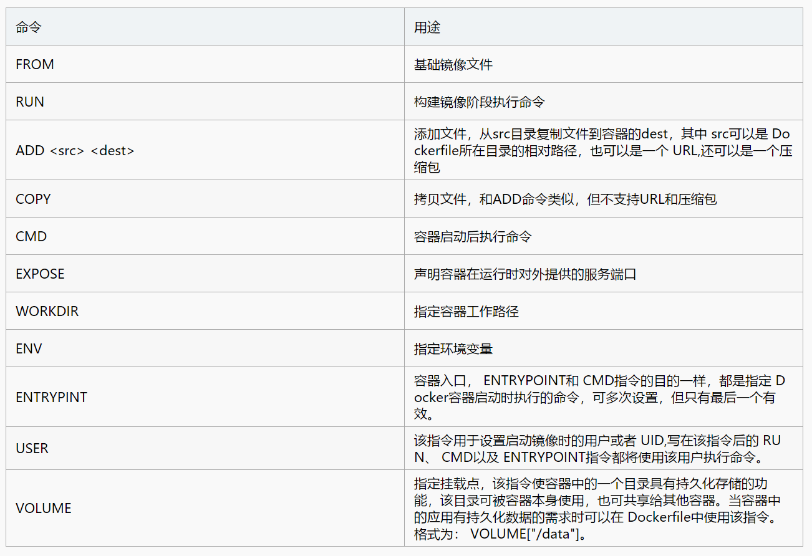

### 什么是 `DockerFile` ?
> Dockerfile 是一个用来构建镜像的文本文件，文本内容包含了一条条构建镜像所需的指令和说明。

### `DockerFile` 的构建？

#### 基础知识
1. 每个保留关键字都必须是大写；
2. 从上往下执行；
3. `#`表示注释；
4. 每个指令都会创建提交一个新的镜像层，并提交。

#### 指令
* FROM: 基础镜像，