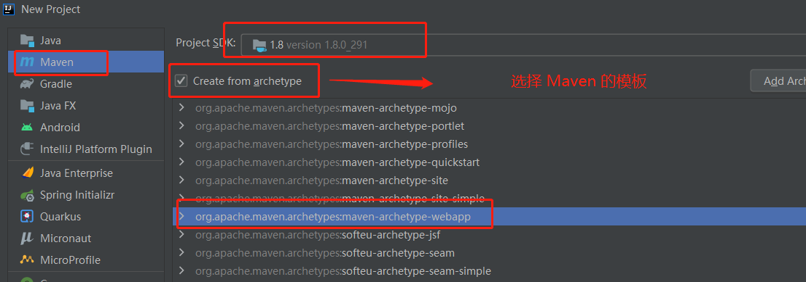
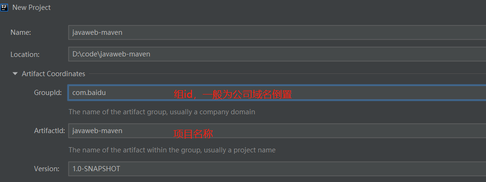
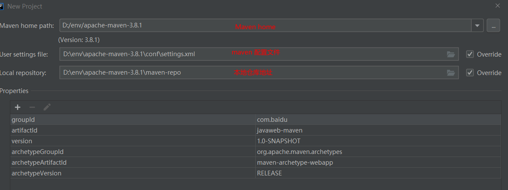
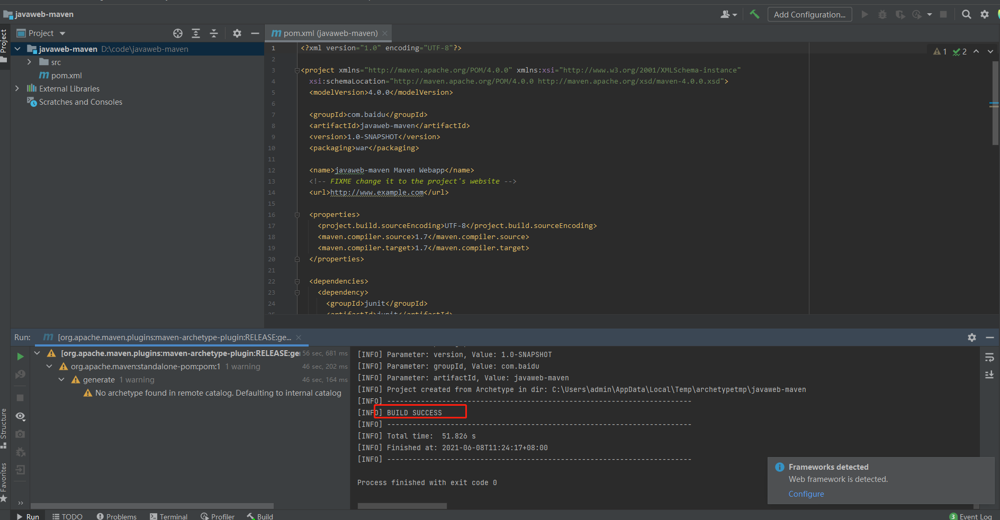
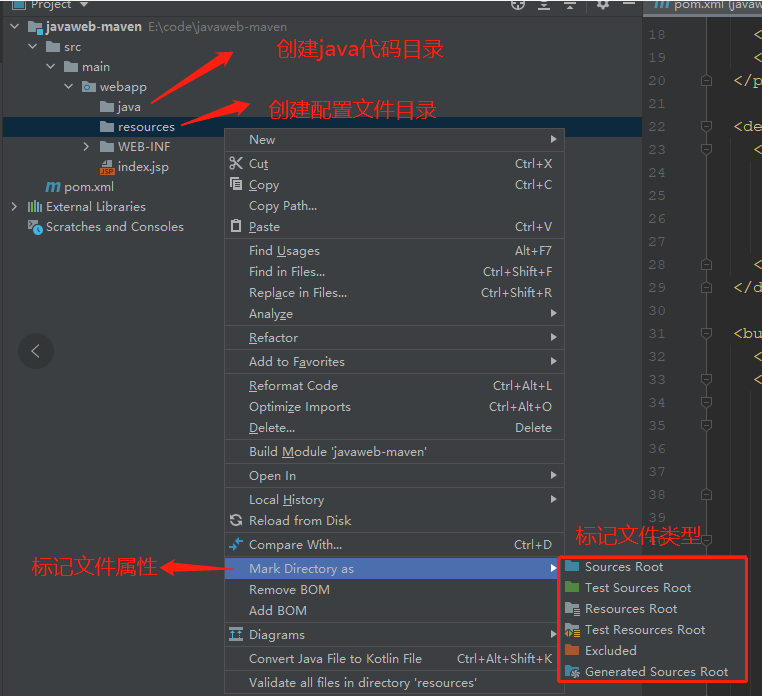
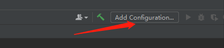
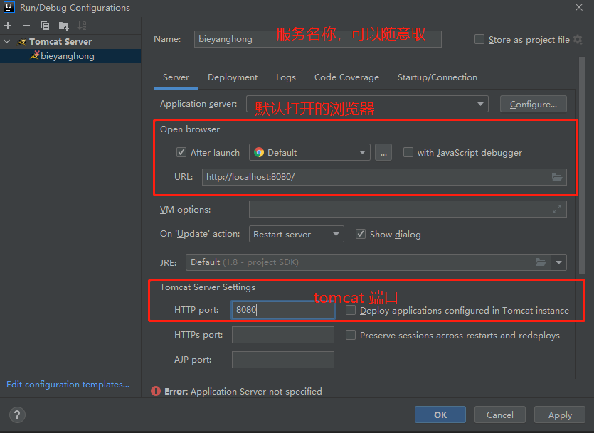
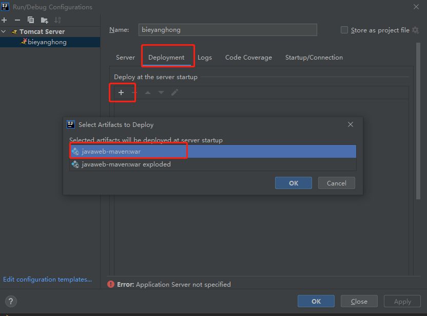
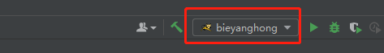
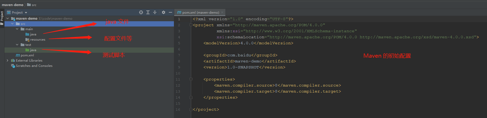

## Maven
> Maven 是一个项目管理工具，可以对 Java 项目进行构建、依赖管理。

### 核心思想：
> 约定大于配置！

### 配置环境变量
1. 系统变量中：
  * `M2_HOME`:  maven 目录下的 bin 目录；
  * `MAVEN_HOME`: maven 目录；
2. 系统 path：
  1. maven 目录下的 bin 目录；
3. `mvn -version`: 测试是否安装成功；
4. 使用阿里云镜像：
```xml
<mirror>
    <id>nexus-aliyun</id>
    <mirrorOf>central</mirrorOf>
    <name>Nexus aliyun</name>
    <url>http://maven.aliyun.com/nexus/content/groups/public</url>
</mirror>
```

5. 配置本地仓库
```xml
<localRepository>你配置的本地仓库地址</localRepository>
```

### 在 `IDEA` 中使用 
#### 使用 `Maven` 的模板创建
1. 创建一个 `MavenWeb` 项目



2. 配置 `MavenWeb` 项目的基础信息



3. 配置 `Maven` 地址



4. 出现 `build success` 表示初始化成功



5. 补充缺少的文件夹



6. 点击配置 `Tomcat` 入口



7. 选择与配置 `Tomcat` 服务






8. `pom.xml` 配置文件
```xml
<?xml version="1.0" encoding="UTF-8"?>

<project xmlns="http://maven.apache.org/POM/4.0.0" xmlns:xsi="http://www.w3.org/2001/XMLSchema-instance"
  xsi:schemaLocation="http://maven.apache.org/POM/4.0.0 http://maven.apache.org/xsd/maven-4.0.0.xsd">
  <modelVersion>4.0.0</modelVersion>

  <groupId>com.baidu.</groupId>
  <artifactId>javaweb-maven</artifactId>
  <version>1.0-SNAPSHOT</version>
  <packaging>war</packaging>

  <name>javaweb-maven Maven Webapp</name>
  <!-- FIXME change it to the project's website -->
  <url>http://www.example.com</url>

  <!-- 配置编译版本等 -->
  <properties>
    <project.build.sourceEncoding>UTF-8</project.build.sourceEncoding>
    <maven.compiler.source>1.7</maven.compiler.source>
    <maven.compiler.target>1.7</maven.compiler.target>
  </properties>

  <!-- 依赖 -->
  <dependencies>
    <dependency>
      <groupId>junit</groupId>
      <artifactId>junit</artifactId>
      <version>4.11</version>
      <scope>test</scope>
    </dependency>
  </dependencies>

  <!-- 打包相关 -->
  <build>
    <finalName>javaweb-maven</finalName>
    <pluginManagement><!-- lock down plugins versions to avoid using Maven defaults (may be moved to parent pom) -->
      <plugins>
        <plugin>
          <artifactId>maven-clean-plugin</artifactId>
          <version>3.1.0</version>
        </plugin>
        <!-- see http://maven.apache.org/ref/current/maven-core/default-bindings.html#Plugin_bindings_for_war_packaging -->
        <plugin>
          <artifactId>maven-resources-plugin</artifactId>
          <version>3.0.2</version>
        </plugin>
        <plugin>
          <artifactId>maven-compiler-plugin</artifactId>
          <version>3.8.0</version>
        </plugin>
        <plugin>
          <artifactId>maven-surefire-plugin</artifactId>
          <version>2.22.1</version>
        </plugin>
        <plugin>
          <artifactId>maven-war-plugin</artifactId>
          <version>3.2.2</version>
        </plugin>
        <plugin>
          <artifactId>maven-install-plugin</artifactId>
          <version>2.5.2</version>
        </plugin>
        <plugin>
          <artifactId>maven-deploy-plugin</artifactId>
          <version>2.8.2</version>
        </plugin>
      </plugins>
    </pluginManagement>
  </build>
</project>

```

#### 手动创建一个 `Maven` 的项目
1. 重复上面的第一步，但是不选择 `Maven` 提供的模板；
2. 其他的均与上面没差别；

