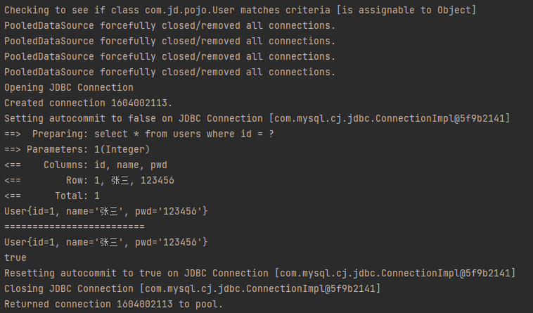
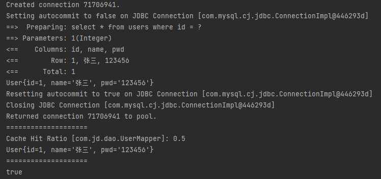

## 什么是缓存 [Cache] ?
* 存在内存中的临时数据；
* 将用户经常查询的数据放在缓存（内存）中，用户去查询数据就不用从磁盘上（关系型数据库数据文件）查询，从缓存中查询，从而提高查询效率，解决了高并发系统的性能问题。

## 为什么使用缓存？
* 减少和数据库的交互次数，较少系统开销，提高系统效率。

## 什么样的数据能使用缓存？
* 经常查询并且不经常改变的数据。

### `Mybatis` 缓存
* `Mybatis` 包含一个非常强大的查询缓存特性，它可以非常方便地定制和配置缓存，缓存可以极大的提升查询效率；
* `Mybatis` 系统中默认定义了两级缓存： `一级缓存` 和 `二级缓存`；
      
    * 默认情况下，只有一级缓存开启，（`SqlSession `级别的缓存，也称为本地缓存）；
    * 耳机缓存需要手动开启和配置，它是基于 `namespace` 级别的缓存。
    * 为了提高扩展性，`Mybatis` 定义了缓存接口 `Cache` ， 我们可以通过实现 `Cache` 接口来自定义二级缓存。

#### 一级缓存
> 一级缓存也叫本地缓存：

* 雨数据库同一次会话期间查询到的数据会放在本地缓存中；
* 以后如果需要获取相同的数据，直接从缓存中拿，减少与数据库的连接。

##### 测试
1. 测试文件
```java
public class UserMappperTest {
    @Test
    public void getUserListTest() {
        SqlSession sqlSession = MybatisUtils.getSqlSession();
        UserMapper mapper = sqlSession.getMapper(UserMapper.class);
        User user1 = mapper.getUser(1);
        System.out.println(user1);

        System.out.println("=========================");

        User user2 = mapper.getUser(1);
        System.out.println(user2);

        System.out.println(user1 == user2);

        sqlSession.close();
    }
}
```

2. 输出日志


3. 结论:在一次会话期间，查询两次接口，返回的数据完全相同，甚至指向同一个地址。

##### 缓存失效的情况
1. 查询不同的内容；
2. 增删改操作，可能会改变原来的数据（就算改变的不是同一个数据），所以必定会刷新缓存;
3. 查询不同的 `Mapper.xml`;
4. 手动清理缓存。
```java
sqlSession.clearCache(); // 手动清理缓存
```

##### 小结：
> 一级缓存默认是开启的，只在一次 `sqlSession` 中有效，也就是拿到连接到关闭连接这个区间段！

#### 二级缓存
* 二级缓存也叫全局缓存，一级缓存作用域太低，所以诞生了二级缓存；
* 基于 `namespace` 级别的缓存，一个名称空间，对应一个二级缓存；
* 工作机制：

    * 一个会话查询一条数据，这个数据就会被放在当前会话的一级缓存中；
    * 如果当前会话关闭了，这个会话对应的一级缓存就没了，但是我们想要的是，会话关闭了，一级缓存中的数据被保存到二级缓存中；
    * 新的会话查询信息，就可以从二级缓存中获取内容；
    * 不同的 `mapper` 查询的数据会被放在自己对应的缓存中。

##### 缓存清除策略
* `LRU` – 最近最少使用：移除最长时间不被使用的对象。
* `FIFO` – 先进先出：按对象进入缓存的顺序来移除它们。
* `SOFT` – 软引用：基于垃圾回收器状态和软引用规则移除对象。
* `WEAK` – 弱引用：更积极地基于垃圾收集器状态和弱引用规则移除对象。

##### 使用步骤
1. 开启全局缓存
```xml
<settings>
    <!-- 标准的日志输出 -->
    <setting name="logImpl" value="STDOUT_LOGGING"/>
    <!-- 数据库字段映射 -->
    <setting name="mapUnderscoreToCamelCase" value="True"/>
    <!-- 开启全局缓存 -->
    <setting name="cacheEnabled" value="true"/>
</settings>
```

2. 在要使用二级缓存的 `Mapper` 中开启
```xml
<mapper namespace="com.jd.dao.UserMapper">
    <cache />
    <select id="getUser" resultType="user">
        select * from users where id = #{id}
    </select>
</mapper>

<!-- 或者添加参数 -->
<mapper namespace="com.jd.dao.UserMapper">
    <cache
            eviction="FIFO"
            flushInterval="60000"
            size="512"
            readOnly="true"/>
    <!-- 可以手动的开启或关闭单条 -->
    <select id="getUser" resultType="user" useCache="true">
        select * from users where id = #{id}
    </select>
</mapper>
```

3. 测试
```java
@Test
public void cacheTest() {
    SqlSession sqlSession = MybatisUtils.getSqlSession();
    UserMapper mapper = sqlSession.getMapper(UserMapper.class);
    User user1 = mapper.getUser(1);
    System.out.println(user1);
    sqlSession.close();

    System.out.println("====================");

    SqlSession sqlSession2 = MybatisUtils.getSqlSession();
    UserMapper mapper2 = sqlSession2.getMapper(UserMapper.class);
    User user2 = mapper2.getUser(1);
    System.out.println(user2);
    sqlSession2.close();

    System.out.println("====================");
    System.out.println(user1 == user2);
}
```


##### 小结：
1. 只要开启了二级缓存，在同一个 `Mapper` 下就有效；
2. 所有的数据都会放在一级缓存中；
3. 只有当会话提交或者关闭的时候，才会提交到二级缓存中。


#### `Mybatis` 查询顺序
1. 先在二级缓存中查找是否有数据，如果有，返回数据； 
2. 如果二级缓存中没有数据，则在一级缓存中查找，如果有，则返回数据；
3. 一级缓存中也没有数据的话，则连接数据库查询。