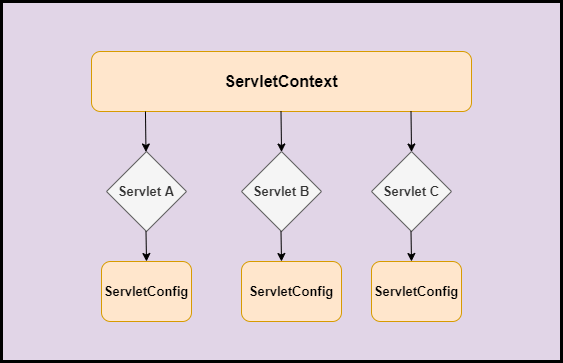

## ServletContext


### 共享数据
> ServletContext是一个全局的储存信息的空间，服务器开始就存在，服务器关闭才释放。
1. 新建一个 `servlet` 存数据；
```java
package com.baidu.servlet01;

import javax.servlet.ServletContext;
import javax.servlet.ServletException;
import javax.servlet.http.HttpServlet;
import javax.servlet.http.HttpServletRequest;
import javax.servlet.http.HttpServletResponse;
import java.io.IOException;
import java.io.PrintWriter;
// 设置共享数据的类
public class Hello extends HttpServlet {
	@Override
	protected void doGet(HttpServletRequest req, HttpServletResponse resp) throws ServletException, IOException {
		// 获取 ServletContext 对象
		ServletContext ctx = this.getServletContext();
		ctx.setAttribute("userName", "别样红");

		PrintWriter writer = resp.getWriter();
		writer.print("Hello Servlet");
	}

	@Override
	protected void doPost(HttpServletRequest req, HttpServletResponse resp) throws ServletException, IOException {
		doGet(req, resp);
	}
}
```

2. 当存数据后，才可以在其他 `servlet` 中访问。
```java
package com.baidu.servlet01;

import javax.servlet.ServletContext;
import javax.servlet.ServletException;
import javax.servlet.http.HttpServlet;
import javax.servlet.http.HttpServletRequest;
import javax.servlet.http.HttpServletResponse;
import java.io.IOException;
import java.io.PrintWriter;

// 读取共享数据的类
public class GetValue extends HttpServlet {
	@Override
	protected void doGet(HttpServletRequest req, HttpServletResponse resp) throws ServletException, IOException {
		// 获得上下文对象
		ServletContext ctx = this.getServletContext();
		// 获取数据
		String userName = (String) ctx.getAttribute("userName");

		// 将数据返回到页面
		resp.setContentType("text/html;charset=utf-8");
		PrintWriter writer = resp.getWriter();
		writer.print("名字：" + userName);
	}

	@Override
	protected void doPost(HttpServletRequest req, HttpServletResponse resp) throws ServletException, IOException {
		doGet(req, resp);
	}
}
```

3. 配置 `servlet`
```xml
<servlet>
    <servlet-name>hello</servlet-name>
    <servlet-class>com.baidu.servlet01.Hello</servlet-class>
</servlet>
<servlet-mapping>
    <servlet-name>hello</servlet-name>
    <url-pattern>/hello</url-pattern>
</servlet-mapping>

<servlet>
    <servlet-name>getv</servlet-name>
    <servlet-class>com.baidu.servlet01.GetValue</servlet-class>
</servlet>
<servlet-mapping>
    <servlet-name>getv</servlet-name>
    <url-pattern>/getv</url-pattern>
</servlet-mapping>
```

### 获取初始化参数
```xml
<context-param>
		<param-name>url</param-name>
		<param-value>http://www.baidu.com</param-value>
</context-param>

<servlet>
		<servlet-name>getp</servlet-name>
		<servlet-class>com.baidu.servlet01.GetParams</servlet-class>
</servlet>
<servlet-mapping>
		<servlet-name>getp</servlet-name>
		<url-pattern>/getp</url-pattern>
</servlet-mapping>
```
```java
package com.baidu.servlet01;

import javax.servlet.ServletContext;
import javax.servlet.ServletException;
import javax.servlet.http.HttpServlet;
import javax.servlet.http.HttpServletRequest;
import javax.servlet.http.HttpServletResponse;
import java.io.IOException;
import java.io.PrintWriter;

public class GetParams extends HttpServlet {
	@Override
	protected void doGet(HttpServletRequest req, HttpServletResponse resp) throws ServletException, IOException {
		ServletContext ctx = this.getServletContext();
		String url = ctx.getInitParameter("url");

		PrintWriter writer = resp.getWriter();
		writer.print(url);
	}

	@Override
	protected void doPost(HttpServletRequest req, HttpServletResponse resp) throws ServletException, IOException {
		doGet(req, resp);
	}
}
```

### 请求转发
> 转发与重定向不同，它不会改变请求地址，而是自己去请求，然后将结果返回给请求者。
```java
@Override
	protected void doGet(HttpServletRequest req, HttpServletResponse resp) throws ServletException, IOException {
		ServletContext ctx = this.getServletContext();
		ctx.getRequestDispatcher("/hello") // 请求转发的路径
			.forward(req, resp); // 实现请求转发
	}
```

### 读取资源配置文件
> 通过绝对路径，读取 resource 中的配置文件。
```java
/*
	-- test.properties
		username:123
*/
public class Demo02 extends HttpServlet {
	@Override
	protected void doGet(HttpServletRequest req, HttpServletResponse resp) throws ServletException, IOException {
		// 通过绝对路径，读取当前项目中的配置文件
		InputStream inputStream = this.getServletContext().getResourceAsStream("/WEB-INF/classes/test.properties");

		Properties properties = new Properties();
		properties.load(inputStream);

		String username = properties.getProperty("username");

		resp.getWriter().print(username);
	}
}
```