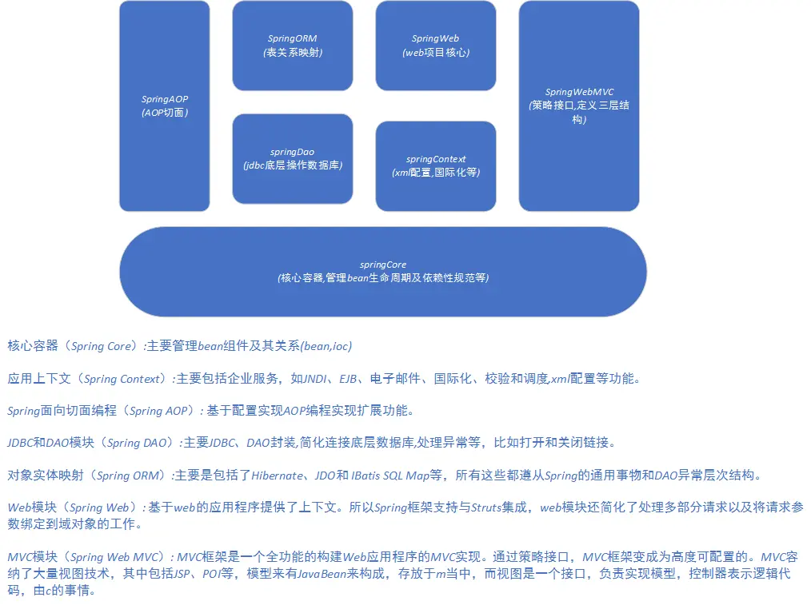

## 什么是 Spring ？
> Spring是Java EE编程领域的一个轻量级开源框架，该框架由一个叫Rod Johnson的程序员在 2002 年最早提出并随后创建，是为了解决企业级编程开发中的复杂性，实现敏捷开发的应用型框架 。 [2] Spring是一个开源容器框架，它集成各类型的工具，通过核心的Beanfactory实现了底层的类的实例化和生命周期的管理。

### Spring 的优点？
1. 低侵入式设计，代码污染极低
2. 独立于各种应用服务器，基于Spring框架的应用，可以真正实现Write Once,Run Anywhere的
承诺
3. Spring的DI机制降低了业务对象替换的复杂性，提高了组件之间的解耦
4. Spring的AOP支持允许将一些通用任务如安全、事务、日志等进行集中式管理，从而提供了更好
的复用
5. Spring的ORM和DAO提供了与第三方持久层框架的良好整合，并简化了底层的数据库访问
6. Spring并不强制应用完全依赖于Spring，开发者可自由选用Spring框架的部分或全部  

### Spring的缺点
* 使用了大量的反射机制，反射机制非常占用内存；
* 由于发展时间过长，体型过于庞大，导致配置内容太多，人称：“配置地狱！”。

### 总结：
Spring 就是一个轻量级的控制反转（IQC）和面向切面编程（AOP）的框架！


### Spring 的组成：



#### Hello
1. `pojo` 中新建一个类
```java
package com.jd.pojo;

public class Hello {
    private String str;

    public Hello(String str) {
        this.str = str;
    }

    public Hello() {
    }

    public String getStr() {
        return str;
    }

    public void setStr(String str) {
        this.str = str;
    }

    @Override
    public String toString() {
        return "Hello{" +
                "str='" + str + '\'' +
                '}';
    }
}

```

2. 实现 spring 的 xml 配置
```xml
<?xml version="1.0" encoding="UTF-8"?>
<beans xmlns="http://www.springframework.org/schema/beans"
       xmlns:xsi="http://www.w3.org/2001/XMLSchema-instance"
       xsi:schemaLocation="http://www.springframework.org/schema/beans
        https://www.springframework.org/schema/beans/spring-beans.xsd">

        <!--
            bean 就相当于类 new 出来的对象。
            claas: 指向要 new 的那个具体对象；
            id： 表示 new 出来的对象名；
        -->
        <bean id="hello" class="com.jd.pojo.Hello">
            <property name="str" value="Hello Spring" />
        </bean>
</beans>
```

3. 测试
```java
import com.jd.pojo.Hello;
import org.junit.Test;
import org.springframework.context.ApplicationContext;
import org.springframework.context.support.ClassPathXmlApplicationContext;

/**
 * @Description
 * @Author bieyanghong
 * @Date 2021/7/5 15:26
 */
public class HelloTest {

    @Test
    public void HelloJavaTest() {
        // 通过 ClassPathXmlApplicationContext 获取 spring 的上下文
        ApplicationContext context = new ClassPathXmlApplicationContext("ApplicationConfig.xml");

        // 获取配置文件中的 bean， 也就是对应类 new 出来的对象
        Hello hello = (Hello) context.getBean("hello");

        // 调用类中的方法
        System.out.println(hello.toString());
    }
}
```