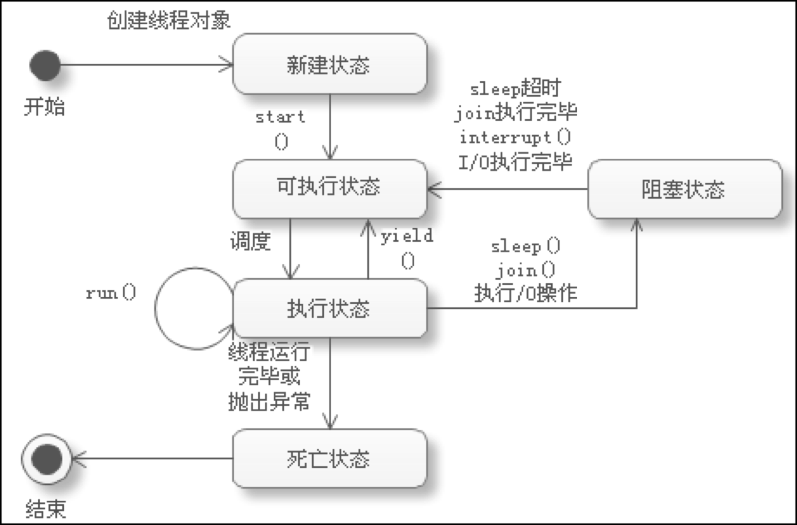

## 线程的五大状态

* `NEW`: 尚未启动的线程处于此状态；
* `RUNNABLE`: 在 `Java` 虚拟机中执行的线程处于此状态； 
* `BLOCKED`: 被阻塞等待监视器锁定的线程处于此状态；
* `WAITING`: 正在等待另一个线程执行特定动作的线程处于此状态；
* `TIME_WAITING`: 正在等待另一个线程执行动作达到指定等待时间的线程处于此状态；
* `TERMINATED`: 已退出的线程处于此状态。
 
 ### 观测线程的状态
 ```java
public class State {
	public static void main(String[] args) {
		// 使用 lambda 表达式创建 Thread 实例
		Thread thread = new Thread(() -> {
			for (int i = 0; i < 10; i++) {
				try {
					Thread.sleep(1000);
				} catch (InterruptedException e) {
					e.printStackTrace();
				}
			}
		});
		thread.start();

		// 获取线程的状态
		System.out.println(thread.getState());

		// 当线程处于死亡状态，则退出循环
		while (thread.getState() != Thread.State.TERMINATED) {
			System.out.println(thread.getState());
		}

		System.out.println(thread.getState());
	}
}

 ```
### 线程停止
> 推荐内部提供一个方法去停止当前线程，在实例化后，可以通过实例对象调用该方法关闭该线程。
```java
public class StopThread implements Runnable {
    private boolean isStopFlag = false;
    @Override
    public void run() {
        while (!isStopFlag) {
            System.out.println("其他线程执行的方法");
        }
    }

    // 内部提供自动关闭线程的方法
    public void stop() {
        this.isStopFlag = true;
    }
}
```

### 线程休眠
* `sleep(time)` 指定当前线程阻塞的毫秒数；
* `sleep` 存在异常 `interruptedException`;
* `sleep` 时间达到后线程进入就绪状态；
* `sleep` 可以模拟网络延时，倒计时等；
* 每一个对象都有一个锁， `sleep` 不会释放锁。

```java
public class SleepDemo {
    private int count = 60;
    // 模拟 60 秒倒计时
    public void countDown() {
        while (count >= 0) {
            try {
                Thread.sleep(1000);
                System.out.println("剩余时间：" + count--);
            } catch (InterruptedException e) {
                e.printStackTrace();
            }
        }
    }
}
```

### 线程礼让
* 礼让线程，让当前正在执行的线程暂停，但不阻塞；
* 将线程从运行状态转为`就绪状态`；
* 让 `cpu` 重新调度，礼让不一定成功！

```java
public class YeildDemo implements Runnable {
    @Override
    public void run() {
        System.out.println(Thread.currentThread().getName() + "线程开始执行");
        Thread.yield();
        System.out.println(Thread.currentThread().getName() + "线程结束");
    }
}

public class Application {
    public static void main(String[] args) {

        YeildDemo yeildDemo = new YeildDemo();

        new Thread(yeildDemo, "进程A").start();
        new Thread(yeildDemo, "进程B").start();
    }
}
```

### 线程合并
> 待此线程执行完成后，在执行其他线程，其他线程阻塞。可以理解成现实生活中的插队。

```java
public class JoinDemo implements Runnable {
    @Override
    public void run() {
        for (int i = 0; i < 1000; i++) {
            System.out.println("vip 开始执行" + i);
        }
    }
}

public class Application {
    public static void main(String[] args) {
        JoinDemo joinDemo = new JoinDemo();

        Thread thread = new Thread(joinDemo);
        thread.start();

        for (int i = 0; i < 500; i++) {
            if (i == 200) {
                try {
                    thread.join(); // 开始插队，只有该线程执行完成后，才能执行其他线程的任务，包括主线程
                } catch (InterruptedException e) {
                    e.printStackTrace();
                }
            }
            System.out.println("主线程在执行任务" + i);
        }
    }
}

```
