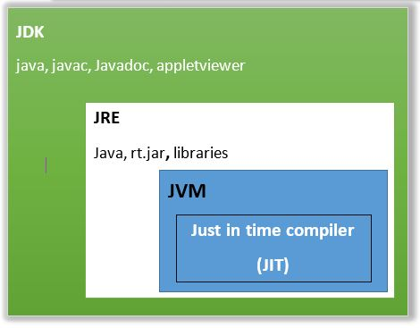

## java 版本
* JavaSE：标准版，基于个人计算机的应用。
* JavaEE：企业版，定位在服务器端的应用。（包含JavaSE）
* JavaME：微型版，消费型电子产品。（不常用）

## java

### JVM
1. `JVM` 全称 `Java Virtual Mechinal`，即 Java 虚拟机。`JVM 是驻留于内存中的抽象计算机，可以理解为一个虚拟的计算机`，它是通过在真实计算机上仿真模拟各种计算机功能来实现的，具有处理器、堆栈、寄存器等完善的硬件架构以及相应的指令系统，通过抽象 `CPU` 和操作系统结构，使代码的执行与主机硬件、主机操作系统无关。

2. `JVM` 关注的是 `Java` 字节码文件（类文件 .class），Java 字节码文件由 JVM 指令集、符号表以及一些补充信息组成。`JVM 的主要工作是将 Java 字节码解释为本地机器码，实际就是将自己的指令集（Java 字节码）映射为本地 CPU 的指令集或操作系统的接口调用（本地机器码）`。

3. `Java` 语言的跨平台性，其实就是靠不同平台版本的 `JVM` 来实现的。不同的操作系统，使用不同的 `JVM` 映射规则，使 `Java` 字节码的解释执行与操作系统无关，从而完成跨平台（一次编译，到处执行）。也就是说，`能跨平台的是 Java 程序，而 JVM 是不能跨平台的`，对于不同的操作系统平台有不同的 `JVM` 实现，`Java` 程序的跨平台性就是通过 `JVM` 的不跨平台实现的。

### JDK
1. JDK 全称 Java Development Kit，即 Java 开发工具包，是面向 Java 开发人员使用的 SDK（Software Development Kit，软件开发工具包），提供了 Java 程序的开发环境和运行环境。

2. JDK 包含了 JRE、基础类库（Java API，如网络、IO、线程、图形等）、Java 源码编译器 javac、以及其它的一系列用于开发、诊断、分析、调试、管理的工具和命令，如 jar、javah、native2ascii、jdb、jconsole、jstat、jps、jmap、jhat 等。

### JRE
1. `JRE` 全称 `Java Runtime Environment`，即 Java 运行时环境，由运行和管理 Java 应用程序的类库和工具组成。

2. `JRE` 中包含了 `JVM`，单纯的 `JVM` 不能运行 `Java` `程序，JVM` 在解释 `Java` 字节码时需要用到一些核心类库，这些核心类库就被包含在 `JRE` 中，简单来说 `JRE` 就是 `JVM` + 核心类库。

### 三者的关系
* JDK = JRE + 开发工具
* JRE = JVM + 类库