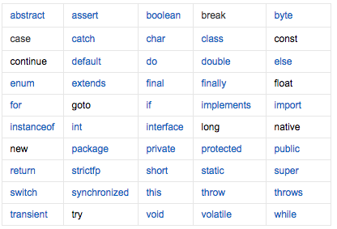

## idea 中新建空项目
1. `New Project `时选择 `Empty Project`;
2. 在项目中选择`New Module`，选择类型，如 `java`，设置好`jdk`与模块名；
2. 设置`Project Structure` 中的 `Project`,选择 `SDK`版本和 `Project Language Level`两者版本要与之对应;

## 注释
* 单行注释：`//`
* 多行注释：`/**/` 
* javadoc: 
  * @author 作者;
  * @version 版本;
  * @since 知名需要最早使用的 jdk 版本;
  * @param 参数名;
  * @return 返回值情况;
  * @throws 异常抛出情况;

### 通过 `javadoc` 生成文本
```cmd
javadoc -encoding UTF-8 -charset UTF-8 xxx
```

## 标识符
* Java 所有的组成部分都需要名字。类名，变量名以及方法名都被成为标识符。



## 变量名
### 命名规范
* 首字母应该以字母（A-Z或a-z），`$`,`_`开始；
* 首字母之后，可以是字母，`$`, `_` 或数字的任何字符组合；
* 不能使用关键字作为变量名和方法名。
* 区分大小写；
```java
// 合法标识符
// aga, $salary, _value,

// 非法
// 123aaa -salary #aaa
```

