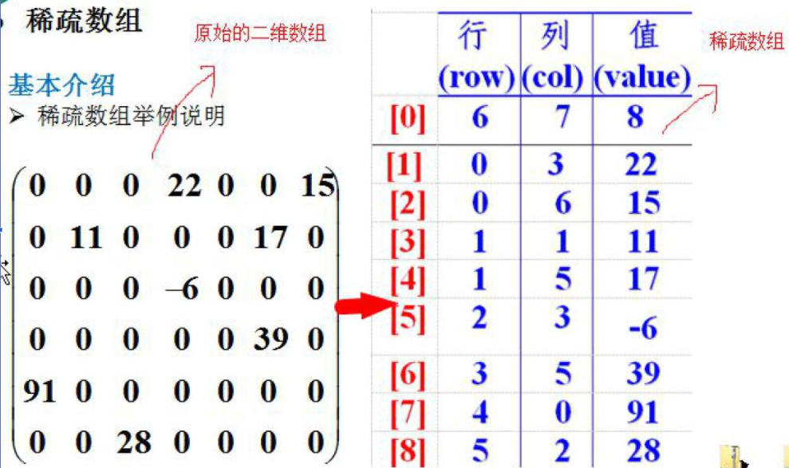

## 稀疏数组
> 当一个数组中大部分元素为0，或者为同一值得数组时，可以使用稀疏数组来保存该数组。



### 稀疏数组的处理方式：
* 记录数组一共有几行几列，有多少个不同值；
* 把具有不同值得元素和行列及值记录在一个小规模得数组中，从而缩小程序得规模。


```java
public class SparseArray {
    public static void main(String[] args) {
        // 原数组
        int[][] arr = new int[11][11];
        arr[1][2] = 1;
        arr[2][3] = 2;

        for (int i = 0; i < arr.length; i++) {
            for (int j = 0; j < arr[i].length; j++) {
                System.out.print(arr[i][j] + "\t");
            }
            System.out.println();
        }

        System.out.println("用稀疏数组代替上一个数组");

        // 用稀疏数组去实现
        // 1. 计算存在多少个有效数据，然后用这个长度创建稀疏数组
        int count = 0;
        for (int i = 0; i < arr.length; i++) {
            for (int item: arr[i]) {
                if (item != 0) count++;
            }
        }
        System.out.println("有效数据的个数：" + count);

        // 2. 创建稀疏数组
        int[][] sparseArr = new int[count + 1][3];
        sparseArr[0][0] = arr.length;
        sparseArr[0][1] = arr[0].length;
        sparseArr[0][2] = count;

        // 3.将有效数据存入稀疏数组中
        int key = 1;
        for (int i = 0; i < arr.length; i++) {
            for (int j = 0; j < arr[i].length; j++) {
                if (arr[i][j] != 0) {
                    sparseArr[key][0] = i;
                    sparseArr[key][1] = j;
                    sparseArr[key][2] = arr[i][j];
                    key++;
                }
            }
        }

        System.out.println("稀疏数组为：");
        for (int i = 0; i < sparseArr.length; i++) {
            for (int item: sparseArr[i]) {
                System.out.print(item + "\t");
            }
            System.out.println();
        }

        // 将稀疏数组还原成原数组
        // 创建原数组
        int[][] arr1 = new int[sparseArr[0][0]][sparseArr[0][1]];
        for (int i = 0; i < sparseArr.length; i++) {
            if (i > 0) {
                arr1[sparseArr[i][0]][sparseArr[i][i]] = sparseArr[i][2];
            }
        }
        System.out.println("原数组为：");
        for (int i = 0; i < arr.length; i++) {
            for (int j = 0; j < arr[i].length; j++) {
                System.out.print(arr[i][j] + "\t");
            }
            System.out.println();
        }
  }
}


```