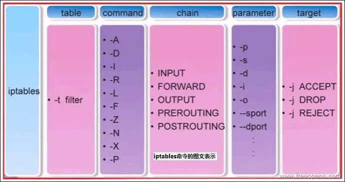

### 软件防火墙
> 软件防火墙也称为个人防火墙，它是最常用的防火墙，通常作为计算机系统上的程序运行。一般基于某个操作系统平台开发，直接在计算机上进行软件的安装和配置。
### 硬件防火墙
> 把“软件防火墙”嵌入在硬件中，把“防火墙程序”加入到芯片里面，由硬件执行这些功能，从而减少计算机或服务器的CPU负担。

### 什么是防火墙中的规则表？
> 容纳各种规则链，它有4个表。
1. filter: 确定是否放行该数据包（过滤）;
2. nat: 修改数据包中的源、目标IP地址或端口;
3. mangle: 为数据包设置标记;
4. raw: 确定是否对该数据包进行状态跟踪;

### 什么是防火墙中的规则链
> 主要的作用就是对数据包进行过滤或处理。
* INPUT: 处理入站数据包；
* OUTPUT：处理出站数据包；
* FORWARD：处理转发数据包；
* PREROUTING：在进行路由选择前处理数据包；
* POSTROUTING：在进行路由选择后处理数据包；


## iptables、
> iptables 是 Linux 防火墙工作在用户空间的管理工具，是 netfilter/iptablesIP 信息包过滤系统是一部分，用来设置、维护和检查 Linux 内核的 IP 数据包过滤规则。
### 语法
iptables [-t 表名] 命令选项 ［链名］ ［条件匹配］ ［-j 目标动作或跳转］
1. -t: 表示选择表，默认为 filter，当操作filter时，可以省略该参数；
2. 命令选项： 要操作的行为，如： -A -I 均是添加新的规则；
3. -j: 可选项为
  * ACCEPT： 允许；
  * DROP：丢弃；
  * REJECT：拒绝。

### 查看已添加的规则
```bahs
# 查看 filter 表的规则
iptables -t filter -nvL
# 由于 filter 为默认，则可以省略
iptables -nvL
```

### 添加规则
> 当匹配到一个规则链后，则停止，不在往下查找。
#### 参数
* -s, --source [!] address[/mask] ：把指定的一个／一组地址作为源地址，按此规则进行过滤。当后面没有 mask 时，address 是一个地址，比如：192.168.1.1；当 mask 指定时，可以表示一组范围内的地址，比如：192.168.1.0/255.255.255.0。
* -p：匹配协议,如tcp,udp,icmp，只有使用 `-p tcp` 后，才可以指定端口；
* -d：目的地地址，在 input 规则链中无意义。
```bash
# -A 在规则链的末尾加入新规则
iptables -A INPUT -p tcp --dport 22 -j ACCEPT
# 指定 ip 段是否可以访问
iptables -A INPUT -s 192.168.1.0 --dport 22 -j ACCEPT

# -I 顶部插入规则
iptables -I INPUT -p tcp --dport 22 -j ACCEPT
```

### 修改默认规则
```bash
# 修改默认规则
iptables -P INPUT ACCEPT
```
### 清除规则
#### -F
> 只会清楚添加的规则，不会清楚默认规则

#### -D
> 删除规则
```bash
# 根据序号删除
iptables -D INPUT 2
```
