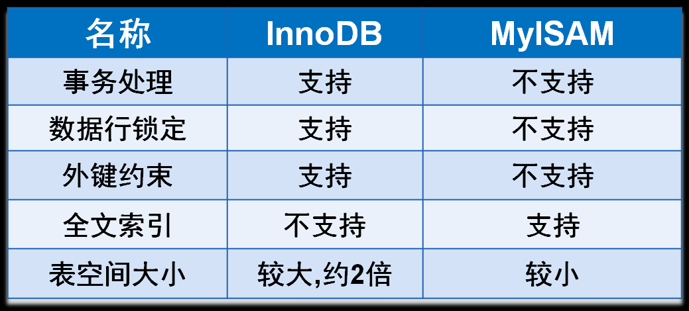

## 建表
```sql
CREATE TABLE [IF NOT EXISTS] `表名` (
  `字段名` 列类型 [属性] [索引] [注释],
  `字段名` 列类型 [属性] [索引] [注释],
  `字段名` 列类型 [属性] [索引] [注释],
) [表类型] [字符集设置] [注释]
```

### 数据库表的引擎（ENGINE）

#### INNODB(默认)
* 安全性高，支持事务的处理，支持多表多用户操作；
* 在物理空间，对应着`data`目录下的 `*.frm`文件，以及上级目录下的 ibdata1 文件；

#### MYISAM
* 节约空间，速度较快。
* 对应文件：
  * `*.frm`: 表结构的定义文件；
  * `*.MYD`: 数据文件（data）;
  * `*.MYI`: 索引文件（index）；

### 字符集
> 如果不设置，使用的就是 `mysql` 默认的字符集，不支持中文。
* utf8: 是针对Unicode的一种可变长度字符编码,只支持最长三个字节的 UTF-8字符，也就是 Unicode 中的基本多文本平面。
* utf8mb4: utf8是utf8mb4的子集，除了将编码改为utf8mb4外不需要做其他转换。而在各类符号文字逐步发展的过程中，像是包括 Emoji 表情(Emoji 是一种特殊的 Unicode 编码，常见于 ios 和 android 手机上)，和很多不常用的汉字，以及任何新增的 Unicode 字符等等都需要进行编码，所以utf8mb4应运而生


### 查看表的创建语句和结构
```sql
-- student 为表名
SHOW CREATE TABLE student

-- 查看表名为student的结构
DESC student
```


### 示例
```sql
CREATE TABLE `student4` (
	`id` INT(6) NOT NULL AUTO_INCREMENT COMMENT '学员id，主键',
	`name` VARCHAR(30) NOT NULL DEFAULT('匿名') COMMENT '学员名称',
	`sex` TINYINT NOT NULL DEFAULT(1) COMMENT '性别，1 表示男（默认），0 表示女。',
	`age` INT(3) DEFAULT(NULL) COMMENT '年纪',
	`birthday` DATE NOT NULL COMMENT '出生日期',
	`address` VARCHAR(100) DEFAULT(NULL) COMMENT '家庭住址',
	`is_delete` TINYINT DEFAULT(0) COMMENT '删除标志位，0 表示未删除，1 表示已删除',
	`gmt_create` DATETIME NOT NULL COMMENT '创建时间',
	`gmt_update` DATETIME NOT NULL COMMENT '修改时间',
	`version` BIGINT(20) NOT NULL COMMENT '乐观锁',
	PRIMARY KEY(`id`)
) ENGINE=INNODB CHARSET=utf8mb4 COMMENT='学员表'
```

## 修改表
* 修改表名: `ALTER TABLE 旧表名 RENAME AS 新表名`
```sql
-- 修改表名 
ALTER TABLE student RENAME AS student1

-- ALTER TABLE 表名 CHANGE 修改前的表名 修改后的表名 属性
ALTER TABLE student CHANGE `name` `userName` VARCHAR(40)  -- 可以修改字段名和属性

-- ALTER TABLE 表名 MODIFY 要修改的字段名 要修改的属性
ALTER TABLE student MODIFY `userName` VARCHAR(30) 				-- 只可以修改属性，而不可修改字段名

-- 删除表的字段 ALTER TABLE 表名 DROP 字段名
ALTER TABLE student DROP age
```

## 删除表 DROP TABLE [IF EXISTS] 表名
```sql
-- 删除表
DROP TABLE student

-- 增加容错
DROP TABLE IF EXISTS student
```