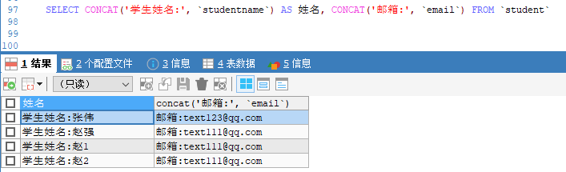

## DQL(最重要)
> data query language 数据查询语言

### 语法
```sql
-- 关键字的顺序不能乱
select [all | distinct]
{ * | table.* | [table.field1[as alias1] [,table.field2[as alias2]] [,...]] }
from table_name [as table_alias]
[left | right | inner join table_name2] -- 连表查询
[where ...] -- 按条件查询
[group by ...] -- 指定结果按照哪几个字段来分组
[having] -- 筛选满足条件的组，即在分组之后过滤数据，条件中经常包含聚合函数
[order by ...] -- 按照一个或多个条件排序
[limit {[offset,]row_count | row_countOFFSET offset }]; -- 指定查询的记录从哪条至哪条，所有语句的最后一条
```

### 查询指定字段
> select 字段名,[字段名,...] from 表名
```sql
-- 查询表中所有字段
SELECT * FROM `student`

-- 查询表中具体某个字段
SELECT `studentname` FROM `student`

-- 查询多个字段
SELECT `studentname`,`email` FROM `student`
```

### `as`(别名)
> 有时候，列名不是那么的见名知意，这个时候，给查询的字段起别名，能够展示的更加直观。
```sql
SELECT `studentname` AS 姓名,`email` AS 邮箱 FROM `student`
```

### `concat()`合并字符串
> 合并字符串，将查询的结果，加上统一的前缀等。
```sql
SELECT CONCAT('学生姓名:', `studentname`) AS 姓名, CONCAT('邮箱:', `email`) FROM `student`
```


### `distinct`(去重)
> 对查出来的`数据`进行去重，也就是说，它是对查出来的数据进行比较，去掉完全相同的数据（每个查询的字段都要相同）。
```sql
-- 1. 举例： 查询表中有多少学生
SELECT `studentno` FROM `result`

-- 2. 发现，成绩表中，每个学生对应多个数据，单独查询这个字段，会有重复的数据
SELECT DISTINCT `studentno` FROM `result`
```

### 其他
```sql
-- 查询数据库版本; `函数`
SELECT VERSION() -- VERSION() 为一个函数

-- 执行计算结果; `表达式`
SELECT 2*16 -1 AS '计算结果'

-- 查询自增步长; `变量`
SELECT @@auto_increment_increment

-- 操作数值，在原数据上 +1
SELECT `studentno`,`studentresult` + 1 AS 成绩 FROM `result`
```

### `where` 条件子句
> 检索数据中符合条件的值。当可以使用`关键字`和`符号`表示的时候，推荐使用`关键字`。
#### 逻辑运算符
* 逻辑与: `and`,`&&`
* 逻辑或: `or`,`||` 
* 逻辑非: `not`, `!`
```sql
-- 查询学号不等于 1000 的学员成绩
SELECT `studentno`,`studentresult` FROM `result`
WHERE studentno!=1000

SELECT `studentno`,`studentresult` FROM `result`
WHERE NOT studentno = 1000

-- 查询学号大于 1002 的学员并且成绩区间为[90, 100]
SELECT `studentno`,`studentresult` FROM `result`
WHERE `studentresult` BETWEEN 90 AND 100 AND studentno >= 1002
```

### 模糊查询(比较运算符)
* `IS NULL`: 如果操作符为 `NULL`,则结果为真。 `a IS NULL`;
* `IS NOT NULL`: 如果操作符不为`NULL`,则结果为真。`a IS NOT NULL`;
* `BETWEEN N AND M`: 如果操作符在 `N`,`M` 之间，则为真。`a BETWEEN 3 AND 9`;
* `LIKE`: `a like b`,如果 `a` 匹配 `b`，则为真;
  * `%`: 替代0个或多个字符;
  * `_`: 替代一个字符;
* `IN`: `a in (a1, a2, a3)`,如果`a`在`a1`,`a2`...其中的某一个值中，则为真。
```sql
-- in 必须是精确相等
SELECT `studentno`,`studentname` FROM `student`
WHERE `studentno` IN (1000, 1002, 1004, 1006)

-- 不管是字符串还是数值都可以使用 in
SELECT `studentno`,`studentname` FROM `student`
WHERE `studentname` IN ('周文', '张伟')

-- 还可以添加其他条件，来更精确得查询
SELECT `studentno`,`studentname` FROM `student`
WHERE `studentname` IN ('周文', '张伟') AND `studentno`=1000

-- 查询张姓学员，后面是n位字符串的
SELECT `studentno`,`studentname` FROM `student`
WHERE `studentname` LIKE '张%'

-- 查询中间有 思 字的结果
SELECT `studentno`,`studentname` FROM `student`
WHERE `studentname` LIKE '%思%'

-- 查询张姓学员，后面是一位字符串的
SELECT `studentno`,`studentname` FROM `student`
WHERE `studentname` LIKE '张_'

-- 查询张姓学员，后面是两位字符串的
SELECT `studentno`,`studentname` FROM `student`
WHERE `studentname` LIKE '张__'
```
