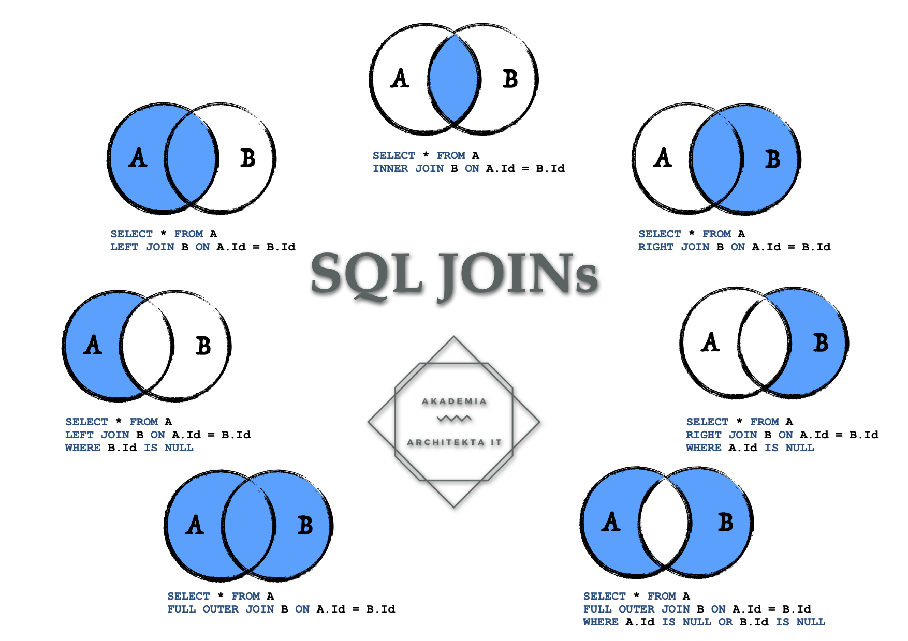

## 连表查询(JOIN)
> SQL JOIN 子句用于把来自两个或多个表的行结合起来，基于这些表之间的共同字段。
### 思路
* 多表查询的关键，表之前必须要有相同的字段，用来连接；
* 连表查询的本质，就只有三种，`inner `、`left`、`right`，其他的只是增加判断条件；
* `left join`与`right join`的区别，就是以那张表为主体去展示数据，如`left join`，以左表的数据为基础，将关联右表的数据展示，如果左表的数据右表匹配不到的，也照应展示，而右表中多余的数据，不予展示；
* 两张表以上的多表查询，本质上还是表之间的堆砌，先两表查询，查出结果后，再与第三张表...，以此类推。

### 语法
```sql
-- 关联字段名，以哪个表为主体，则使用该表的别名点出来
select 字段名,字段名,l.关联字段名[字段名,...]
from 左表名 as l
[left] join 右表名 as r 
on l.key = r.key
where b.key is null -- 去除左表与右表交叉的部分数据
```
