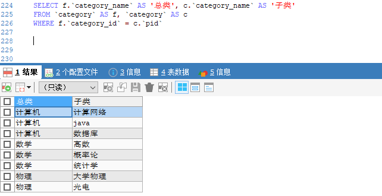

> 就是使用了SQL自身连接，它解决了列与列之间的逻辑关系问题，准确的讲是列与列之间的层次关系。

### 创建表结构
```sql
-- 创建表
CREATE TABLE `category`(
	`category_id` INT(8) NOT NULL AUTO_INCREMENT COMMENT '分类id',
	`category_name`	VARCHAR(30) NOT NULL COMMENT '分类名称',
	`pid` INT(8) NOT NULL COMMENT '父类id',
	`is_delete` TINYINT DEFAULT(0) COMMENT '逻辑删除，0（默认）表示未删除，1 表示已删除',
	`version` INT(20) DEFAULT(1) COMMENT '乐观锁',
	`gmt_create` DATETIME DEFAULT(CURRENT_TIMESTAMP) COMMENT '数据创建时间',
	`gmt_update` DATETIME DEFAULT(CURRENT_TIMESTAMP) COMMENT '数据修改时间',
	PRIMARY KEY(`category_id`)
)ENGINE=INNODB CHARSET=utf8mb4 COMMENT '测试自连表查询'

-- 插入数据
INSERT INTO `category`(`category_name`, `pid`)
VALUES('计算机', 0),('数学', 0),('物理', 0),
('计算网络', 1),('java', 1),('数据库', 1),
('高数', 2),('概率论', 2),('统计学', 2),
('大学物理', 3),('光电', 3)
```

### 查询
```sql
-- 自连表查询
SELECT f.`category_name` AS '总类', c.`category_name` AS '子类' 
FROM `category` AS f, `category` AS c
WHERE f.`category_id` = c.`pid`
```

