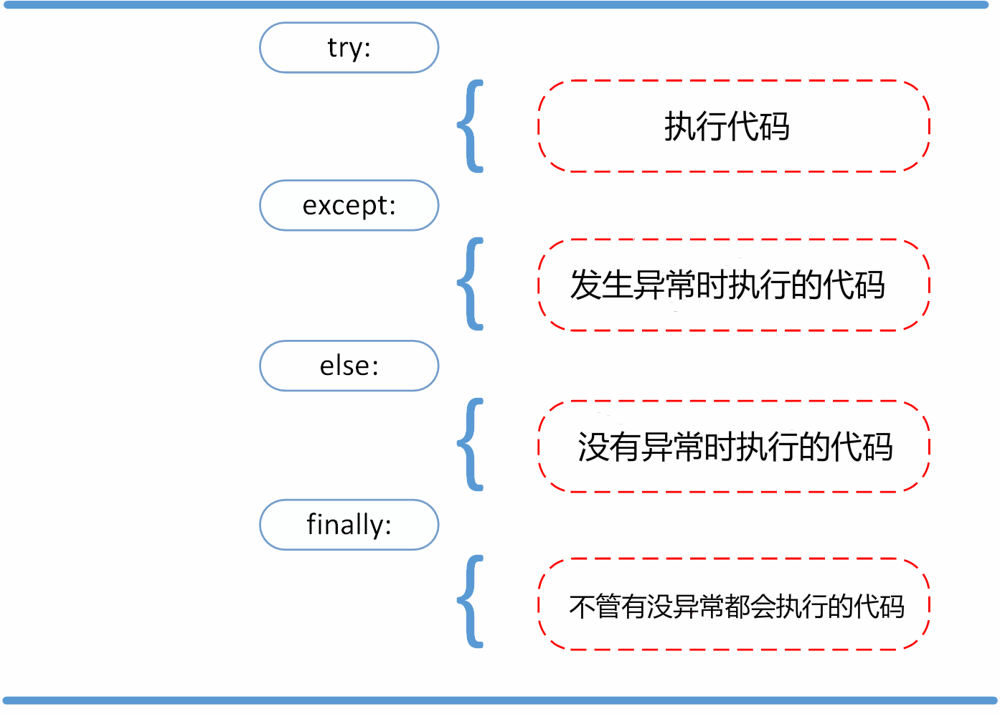

## 异常处理
1. 首先，执行 try 子句（在关键字 try 和关键字 `except` 之间的语句）；
2. 如果没有异常发生，忽略 `except` 子句，try 子句执行后结束；
3. 如果在执行 try 子句的过程中发生了异常，那么 try 子句余下的部分将被忽略。如果异常的类型和 `except` 之后的名称相符，那么对应的 `except` 子句将被执行；
4. 一个 `try` 语句可能包含多个 `except` 子句，分别来处理不同的特定的异常。最多只有一个分支会被执行；
5. 如果一个异常没有与任何的 `except` 匹配，那么这个异常将会传递给上层的 `try` 中；
6. `else` 子句将在 `try` 子句没有发生任何异常的时候执行；
7. `finally` 语句无论是否发生异常都将执行最后的代码。


### `try/except`
```py
# 指定具体的错误类型
num1 = 'abc'
try:
  x = int(num1)
except ValueError:
  print("不是数字！")

# 不指定具体的错误类型，捕获所有的错误
num1 = 'abc'
try:
  x = int(num1)
except Exception as e:
  print(e) # invalid literal for int() with base 10: 'abc'

```

### `try-else`
> 不产生错误，则执行 `else` 子句。
```py
try:
  print(1 + 2)
except NameError:
  print('产生错误')
else:
  print('如果不产生错误执行。')
```

### `try-finally`
> 不管是否发生异常，最终都会执行的子句。
```py
try:
  hello()
except NameError:
  print('产生错误')
else:
  print('如果不产生错误，则会执行。')
finally:
  print('无论异常是否发生都会执行。')
```